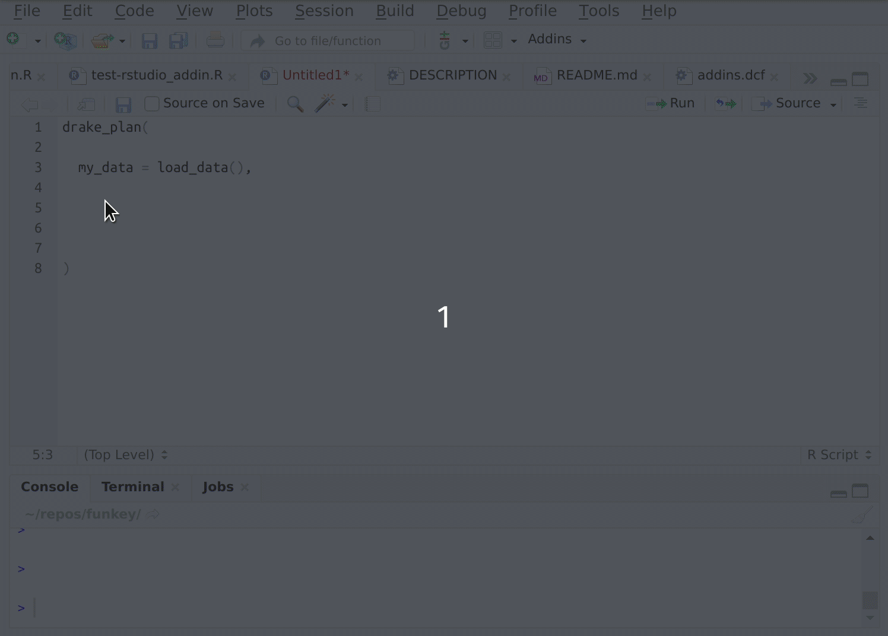

[](https://travis-ci.org/MilesMcBain/fnmate) [](https://ci.appveyor.com/project/MilesMcBain/fnmate)

# Your fnmate

Type a call to a function and have a definition for that function appear with a keystroke. Lay the planks with your `fnmate` but leave the hammering til after smoko.



# Installation

```r
remotes::install_github("milesmcbain/fnmate")
```

# Usage

## RStudio

There are three addins that do pretty much what their names suggest:

  * `Create function definition file`
  * `Create function definition on clipboard`
  * `Create function definition below`
    - as in appended to the end of the current file. Roxygen is not added in this case.

You can bind these to key combinations of your choosing, see [here](https://docs.posit.co/ide/user/ide/guide/productivity/add-ins.html#keyboard-shortcuts)

The function to be generated is determined by the cursor position.  The function call at the most nested scope that encloses the cursor is the one that `fnmate` will generate a definition for.

There's another helper addin:

  * `Jump to function definition` which gives you a project-wide function definition jump (repository-wide). This is convenient in RStudio and VSCode where jumping to definitions in newly created files that haven't been opened is either not possible (VSCode) or prone to failure (RStudio). This addin depends on some third party software. The default (and best) option looks for `rg` on the PATH for ultra-fast definition grepping - install from [ripgrep repo](https://github.com/BurntSushi/ripgrep).
    - Alternately configure the addin to use `git grep` (built into `git`) by setting the option `fnmate_searcher = "git_grep"`


## Emacs (ESS)

There is some Emacs lisp you can use to create bindings to `fnmate` contained in the vignette *Using fnmate with ESS*. If you have better ideas about how to distribute ESS 'addins' please let me know!

## VSCode

The RStudio addin is supported in VSCode via `{rstudioapi}` emulation (needs to be turned on with option).

With emulation turned on, configure a keybinding like:

```json
    {
        "description": "create function defintion",
        "key": "ctrl+;",
        "command": "r.runCommand",
        "when": "editorTextFocus",
        "args": "fnmate::rs_fnmate()"
    },
    {
        "description": "jump to function defintion",
        "key": "ctrl+shift+;",
        "command": "r.runCommand",
        "when": "editorTextFocus",
        "args": "fnmate::rs_fn_defn_jump()"
    }
```

## Options

There are some options that affect how `fnmate` works:

  * `fnmate_window` determines how many lines above and below the current cursor position `fnmate` will look for a function call that encloses the cursor. Defaults to 20 which probably covers three standard deviations of coding styles.
  * `fnmate_folder` is the name of the folder in the current working directory to place created definition files. Defaults to "R".
  * `fnmate_placeholder` is the placeholder value that gets put in the function body. Defaults to `NULL`, can be set to any text.
  * `fmate_searcher` is the grep tool to use for the function definition jumping helper. Valid options are `"rg"` (ripgrep), and `"git_grep"`.
  * `fnmate_quote_jump_regex` can be set to `TRUE` if `Jump to function definiton` is not working due to an error in the command. This seems necessary on MacOS and Linux, depending on the shell version.
  * `fnmate_banned_names` is a character vector of function names that will never have defintions generated for them. Handy if you accidentally find yourself generating definitions for things like `tar_target()`
  * `fnmate_generate_roxygen` is a logical that controls whether a Roxygen documentation template is generated. Defaults to `TRUE`.
  * `fnmate_preferred_jump_paths` a glob that is matched to paths when performing a jump to function definition to determine if they should have priority for a jump target, in the case where multiple matching definitions are found. So `"R/*.R"` would prefer R sources in your R folder.

You can modify any of these options by running, for example, `options(fnmate_quote_jump_regex = TRUE)` in your R session or in your `.Rprofile`.

# Why does this exist?

A lot of the time when I attack a problem I find it helps to cruise over the gnarly bits requiring fiddly code by just claiming a function exits that will magically resolve that fiddly bit for me. After I have a high level solution described, I go back and fill in the blanks. This tool helps me clearly mark out the blanks without breaking my flow on the higher level algorithm.

Recently when developing R workflow plans with [`drake`](https://github.com/ropensci/drake) I've found myself wanting a tool like this so that my sketch of the workflow plan can be built, even though some of the targets are just placeholders.

Also realising this idea in a robust way turned out to be way more challenging than I anticipated and necessitated coopting the R parser and its `parseData` output. So it became a learning exercise.
